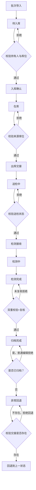

## 1. 产品概述

样本流转链路登记工具，用于记录实验样本从采集、入库、出库、检测到归档的完整交接过程。系统采用本地存储方案，保障数据安全性和离线可用性，适用于实验室、检测机构等对样本追踪有严格要求的场景。

- 解决实验样本流转过程中交接责任不清、位置追踪困难、异常无法回溯的问题
- 提供完整的审计链路和时间线导出，满足合规性要求

## 2. 核心功能

### 2.1 用户角色

| 角色 | 注册方式 | 核心权限 |
|------|----------|----------|
| 采集员 | 预设账户 | 样本采集登记、批次导入 |
| 库管员 | 预设账户 | 库位配置、入库确认、出库确认、交接复核 |
| 检测员 | 预设账户 | 接收检测样本、提交检测结果、检测完成交接 |
| 审核员 | 预设账户 | 归档复核、异常回退操作、审计导出 |
| 管理员 | 预设账户 | 角色管理、系统配置、全部数据访问 |

### 2.2 功能模块

1. **登录页**：角色选择、账户认证、权限加载
2. **仪表盘**：流转统计、待办提醒、异常告警
3. **样本管理**：批次导入、样本列表、详情查看、状态追踪
4. **库位管理**：库位配置、库位状态、容量监控
5. **流转操作**：入库登记、出库交接、检测接收、检测完成、归档复核
6. **异常处理**：异常回退、失败记录、恢复操作
7. **审计导出**：时间线查询、审计日志、CSV/JSON 导出

### 2.3 页面详情

| 页面名称 | 模块名称 | 功能描述 |
|----------|----------|----------|
| 登录页 | 登录表单 | 用户名密码登录、角色自动识别、错误提示 |
| 仪表盘 | 统计概览 | 样本总量、各状态数量、今日流转、异常数量 |
| 仪表盘 | 待办列表 | 当前用户待处理的交接任务 |
| 仪表盘 | 最近活动 | 最新的流转记录时间线 |
| 样本管理 | 批次导入 | CSV/JSON 文件解析、数据校验、预览确认、重复检测 |
| 样本管理 | 样本列表 | 分页、筛选（状态/库位/日期）、搜索、批量操作 |
| 样本管理 | 样本详情 | 基本信息、当前位置、流转历史、交接时间线 |
| 库位管理 | 库位配置 | 新增/编辑/停用库位、层级结构、容量设置 |
| 库位管理 | 库位视图 | 按区域展示、容量占用、当前存放样本 |
| 流转操作 | 入库登记 | 选择样本、校验当前状态、指定库位、确认持有人 |
| 流转操作 | 出库交接 | 校验来源库位、指定接收人、记录交接时间 |
| 流转操作 | 检测接收 | 校验送检状态、确认接收、记录检测开始时间 |
| 流转操作 | 检测完成 | 录入检测结果、提交完成交接 |
| 流转操作 | 归档复核 | 双重校验（检测完成+复核）、最终归档、禁止后续编辑 |
| 异常处理 | 异常回退 | 选择交接记录、校验存在性、回退到上一状态、记录回退原因 |
| 异常处理 | 失败记录 | 展示所有失败的交接尝试、错误原因、恢复状态 |
| 审计导出 | 时间线查询 | 按样本/时间/操作者筛选、完整流转链路展示 |
| 审计导出 | 导出功能 | CSV/JSON 格式导出、包含所有流转记录和操作者信息 |

## 3. 核心流程

### 3.1 主流转流程

用户登录系统后，根据角色权限执行相应操作。样本从采集批次导入开始，依次经过入库、出库送检、检测接收、检测完成、归档复核，最终进入归档状态。每个环节都需要校验当前持有人和目标状态，异常情况下可执行回退操作。

### 3.2 异常回退流程

当发现流转错误时，审核员可执行回退操作。系统会校验目标交接记录是否存在，回退后保留完整的回退记录（操作者、回退原因、时间戳），当前位置恢复到回退前状态，失败交接记录也保留在审计链中。

## 4. 用户界面设计

### 4.1 设计风格

- **主色调**：深青绿色 `#0D9488`（专业、可信赖），配合琥珀色 `#D97706`（警告、待办）
- **辅助色**：石板灰 `#475569`（中性）、翡翠绿 `#10B981`（成功）、玫瑰红 `#E11D48`（错误/异常）
- **按钮风格**：圆角中等（rounded-md）、悬停微阴影、过渡动画 150ms
- **字体**：展示字体 "Noto Serif SC"（中文衬线，正式感），正文字体 "Noto Sans SC"（易读性）
- **布局风格**：顶部导航 + 左侧菜单 + 内容区域三栏，卡片式模块分区
- **图标风格**：Lucide React 线性图标，统一 20px 尺寸，颜色匹配语义

### 4.2 页面设计概览

| 页面名称 | 模块名称 | UI 元素 |
|----------|----------|---------|
| 登录页 | 登录卡片 | 居中玻璃拟态卡片、渐变背景装饰、表单焦点动画 |
| 仪表盘 | 统计卡片 | 四色统计卡（青/蓝/琥珀/灰）、数字放大动效、趋势箭头 |
| 样本管理 | 数据表格 | 斑马纹行、状态标签、悬停高亮、操作按钮组 |
| 流转操作 | 步骤向导 | 垂直步骤条、当前步骤高亮、已完成打勾、校验提示 |
| 异常处理 | 时间线 | 左侧时间轴、事件卡片、状态颜色标识、回退记录特殊标记 |
| 审计导出 | 导出面板 | 格式选择器、筛选条件、预览表格、下载按钮 |

### 4.3 响应式

- Desktop-first 设计，主内容区最小宽度 1024px
- 平板端（768-1024px）：左侧菜单折叠为图标模式
- 移动端（<768px）：顶部导航简化，内容区单列堆叠，表格支持横向滚动

### 4.4 设计要点

- 使用 CSS 变量统一管理颜色体系，支持浅色/深色主题切换（默认浅色）
- 卡片使用微妙阴影（shadow-sm）+ 悬停加深（shadow-md）营造层次感
- 状态流转使用连线 + 节点的可视化展示，动画平滑过渡
- 重要操作（归档、回退）使用二次确认对话框，防止误操作
