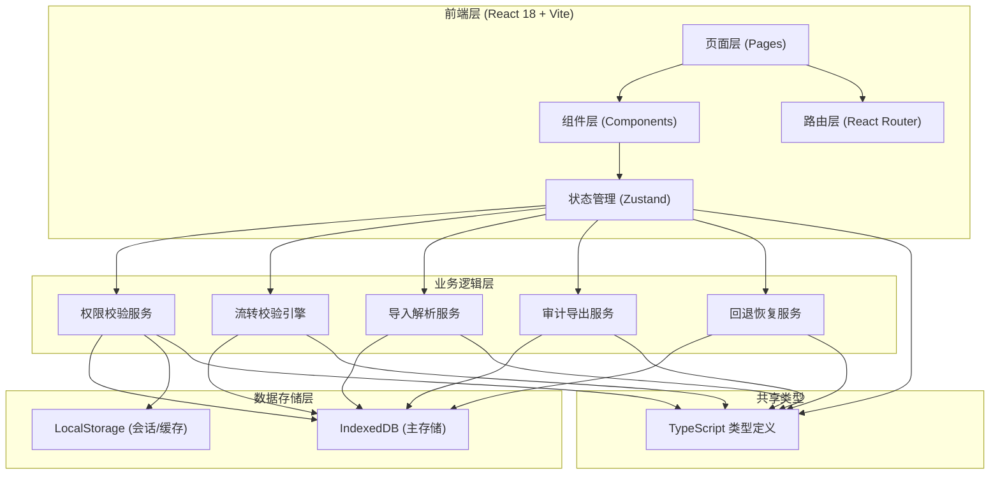
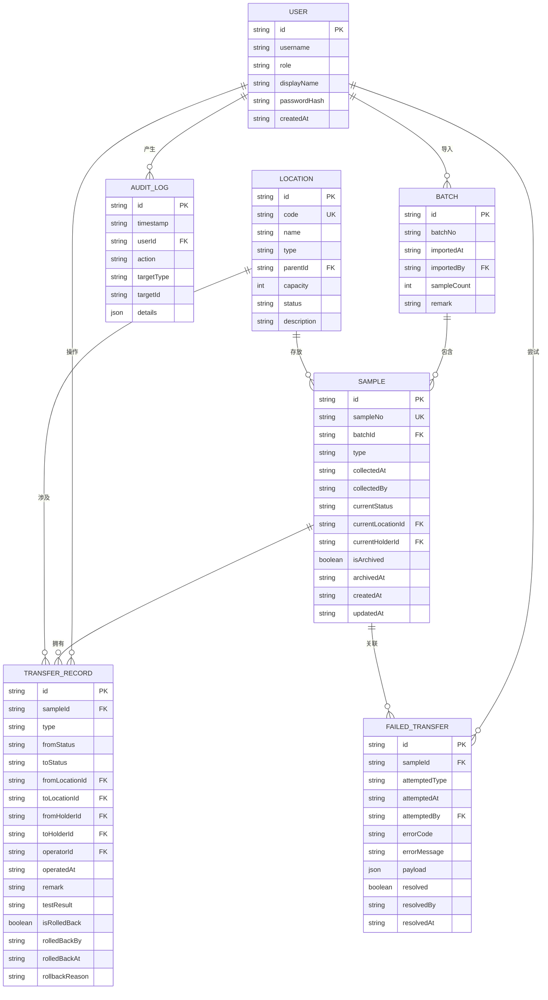

## 1. 架构设计



## 2. 技术说明

- **前端框架**：React@18 + TypeScript@5
- **构建工具**：Vite@5
- **后端服务**：Express@4（可选，主要用于静态文件服务和 MCP 集成，核心逻辑在前端）
- **状态管理**：Zustand@4
- **路由管理**：React Router DOM@6
- **UI 样式**：TailwindCSS@3
- **图标库**：Lucide React
- **本地数据库**：IndexedDB（通过 idb 库封装）
- **数据缓存**：LocalStorage（会话状态、用户偏好）
- **数据导入**：Papa Parse（CSV 解析）
- **数据导出**：原生 JSON/Blob API

## 3. 路由定义

| 路由 | 页面 | 权限要求 | 用途 |
|------|------|----------|------|
| `/login` | 登录页 | 公开 | 用户登录认证 |
| `/dashboard` | 仪表盘 | 所有登录用户 | 统计概览、待办事项、最近活动 |
| `/samples` | 样本列表 | 所有登录用户 | 样本搜索、筛选、查看详情 |
| `/samples/import` | 批次导入 | 采集员、管理员 | CSV/JSON 批次文件导入 |
| `/samples/:id` | 样本详情 | 所有登录用户 | 样本信息、流转历史、时间线 |
| `/locations` | 库位管理 | 库管员、管理员 | 库位配置、状态查看 |
| `/flow/inbound` | 入库登记 | 库管员 | 样本入库操作 |
| `/flow/outbound` | 出库交接 | 库管员、检测员 | 样本出库送检 |
| `/flow/testing/receive` | 检测接收 | 检测员 | 接收检测样本 |
| `/flow/testing/complete` | 检测完成 | 检测员 | 提交检测结果 |
| `/flow/archive` | 归档复核 | 审核员 | 样本最终归档 |
| `/exception/rollback` | 异常回退 | 审核员、管理员 | 流转回退操作 |
| `/exception/failures` | 失败记录 | 审核员、管理员 | 失败交接记录查看 |
| `/audit/timeline` | 审计时间线 | 审核员、管理员 | 流转链路查询 |
| `/audit/export` | 审计导出 | 审核员、管理员 | 审计数据导出 |

## 4. API 接口定义（Express 后端可选层）

```typescript
// 共享类型定义
interface User {
  id: string;
  username: string;
  role: 'collector' | 'warehouse' | 'tester' | 'auditor' | 'admin';
  displayName: string;
}

interface Location {
  id: string;
  code: string;
  name: string;
  type: 'storage' | 'testing' | 'archive';
  parentId?: string;
  capacity: number;
  status: 'active' | 'inactive';
  description?: string;
}

type SampleStatus = 
  | 'imported'      // 已导入待入库
  | 'in_stock'      // 在库
  | 'in_transit'    // 送检中
  | 'testing'       // 检测中
  | 'tested'        // 检测完成
  | 'archived'      // 已归档
  | 'rolled_back';  // 已回退

interface Sample {
  id: string;
  sampleNo: string;
  batchId: string;
  type: string;
  collectedAt: string;
  collectedBy: string;
  description?: string;
  currentStatus: SampleStatus;
  currentLocationId?: string;
  currentHolderId?: string;
  isArchived: boolean;
  archivedAt?: string;
  createdAt: string;
  updatedAt: string;
}

interface Batch {
  id: string;
  batchNo: string;
  importedAt: string;
  importedBy: string;
  sampleCount: number;
  remark?: string;
}

type TransferType = 
  | 'import' | 'inbound' | 'outbound' 
  | 'test_receive' | 'test_complete' | 'archive' | 'rollback';

interface TransferRecord {
  id: string;
  sampleId: string;
  type: TransferType;
  fromStatus?: SampleStatus;
  toStatus: SampleStatus;
  fromLocationId?: string;
  toLocationId?: string;
  fromHolderId?: string;
  toHolderId?: string;
  operatorId: string;
  operatedAt: string;
  remark?: string;
  testResult?: string;
  isRolledBack: boolean;
  rolledBackBy?: string;
  rolledBackAt?: string;
  rollbackReason?: string;
}

interface FailedTransfer {
  id: string;
  sampleId: string;
  attemptedType: TransferType;
  attemptedAt: string;
  attemptedBy: string;
  errorCode: string;
  errorMessage: string;
  payload: Record<string, unknown>;
  resolved: boolean;
  resolvedBy?: string;
  resolvedAt?: string;
}

interface AuditLog {
  id: string;
  timestamp: string;
  userId: string;
  action: string;
  targetType: string;
  targetId?: string;
  details: Record<string, unknown>;
  ip?: string;
}
```

## 5. 核心校验规则（流转引擎）

```
校验规则矩阵：

1. 批次导入校验
   ├─ 样本号唯一（拒绝重复样本号）
   ├─ 必填字段完整性
   └─ 日期格式有效性

2. 入库校验
   ├─ 当前状态必须为 'imported'
   ├─ 目标库位必须为 active 状态且 type='storage'
   └─ 目标库位未满（< capacity）

3. 出库校验
   ├─ 当前状态必须为 'in_stock'
   ├─ 当前库位必须与转出库位一致（拒绝从错误库位转出）
   └─ 当前持有人必须与操作人匹配

4. 检测接收校验
   ├─ 当前状态必须为 'in_transit'
   └─ 接收人必须为检测员角色

5. 检测完成校验
   ├─ 当前状态必须为 'testing'
   └─ 操作人必须为当前持有人

6. 归档校验
   ├─ 当前状态必须为 'tested'
   ├─ 必须经过审核员复核（拒绝未复核就归档）
   └─ 操作人必须为审核员角色

7. 已归档保护
   └─ 已归档样本（isArchived=true）拒绝任何普通编辑操作

8. 回退校验
   ├─ 目标交接记录必须存在（拒绝回退不存在的交接）
   ├─ 目标交接记录不能已被回退
   ├─ 当前样本状态必须匹配交接记录的 toStatus
   └─ 操作人必须为审核员或管理员
```

## 6. 数据模型

### 6.1 ER 图



### 6.2 IndexedDB 存储配置

```
数据库名: SampleTrackingDB
版本: 1

对象仓库:
├─ users (keyPath: id, indexes: username(unique))
├─ batches (keyPath: id, indexes: batchNo(unique), importedAt)
├─ samples (keyPath: id, indexes: sampleNo(unique), batchId, currentStatus, currentLocationId)
├─ locations (keyPath: id, indexes: code(unique), type, status)
├─ transferRecords (keyPath: id, indexes: sampleId, operatedAt, operatorId, type)
├─ failedTransfers (keyPath: id, indexes: sampleId, attemptedAt, resolved)
└─ auditLogs (keyPath: id, indexes: timestamp, userId, action)
```
